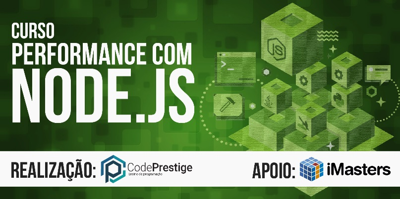

Curso presencial da Code Prestige - Performance com Node.js
======================
Repositório oficial do curso: Performance com Node.js - TODO: inserir link aqui

Edições
------
| Código        | Data          | Link  |
| ------------- |:-------------:| -----:|
| NODEPER01     | 06/02/2017    | [aqui](https://www.eventbrite.com.br/e/curso-performance-com-o-nodejs-tickets-43170669635) |

Descrição
------
Nossa proposta neste curso é ir além do Node.js e apresentar um tema muito recorrente, a performance. Vamos passar além do Node.js comum e chegar no Core do projeto:

- O que é o Node e como ele funciona de fato
- Principais causas de quedas de performance
- Performance em APIs e infraestrutura
- Como fazer um código performático
- Tirando proveito do assincronismo
- Utilizando cache em seus servidores Web
- Utilizando a API cluster
- Profilling nativo de memória
- Tratamento de memory leaks
- O que é um flamegraph

O curso será dividido em dois partes de muito código prático. Em cada parte de 1 hora, o instrutor explicará os conceitos e os alunos serão desafiados a colocar esse conhecimento em prática logo em seguida. Ao final, um projeto de aprovação - com prazo de 1 semana para entrega - será proposto para que os alunos possam ganhar o certificado.

**Objetivo**
Capacitar o aluno a criar aplicações performáticas utilizando a plataforma Node.js.

**A quem se destina**
Alunos e profissionais de TI com um nível de experiência moderada em JavaScript.

Instrutor
------
**Lucas Santos**

Lucas é um programador que, desde pequeno, tem duas paixões: Descobrir os segredos da tecnologia e ajudar as pessoas a entendê-los. Estudante de ciências da computação pela UFABC. Trabalha como desenvolvedor desde 2011 criando aplicações de alta disponibilidade e performance. Um grande intusiasta do manifesto DevOps e adora participar de eventos e comunidades. Atualmente é um dos core members do [Training Center](http://trainingcenter.io) e do [ABC-Dev](http://2017.abcdevelopers.org).

[Site](http://lsantos.me) | [Twitter](http://www.twitter.com/@_staticvoid)

Pré-requisitos
------
É muito importante que o aluno tenha instalado na máquina:

- Node (versão 8 LTS ou acima)
- npm (versão 3.x ou acima)
- Editor de texto (Visual Code Studio, Sublime, Atom, Brackets, etc)
- Docker (para execução dos exemplos)

> Importante: Vamos utilizar o Bash como shell, usuários de Windows verifiquem a possibilidade de instalar o [bash for windows](https://www.howtogeek.com/249966/how-to-install-and-use-the-linux-bash-shell-on-windows-10/) ou algum outro emulador disponível. Máquinas virtuais podem ser utilizadas

**Configurações**
Como estaremos utilizando imagens Docker, estes downloads podem ser um pouco pesados se realizados todos juntos, então aconselhamos que todos os alunos baixem as imagens previamente:

- Execute o comando `docker pull <imagem>` para fazer o download de todas as imagens necessárias. Substitua `<imagem>` pelas imagens abaixo e rode um comando por vez:
  - __Imagem 1:__ `nginx`
  - __Imagem 2:__ `redis`
  - __Imagem 3:__ `mongo`
  - __Imagem 4:__ `node` (apenas caso não seja possível a instalação do Node localmente)
- Clone o repositório https://github.com/khaosdoctor/palestra-performance-nodejs/ para a sua máquina, ele contém parte dos exemplos que serão utilizados e explicados

**Conhecimento**
Para melhor aproveitamento do curso, recomendamos que o aluno saiba o básico sobre tecnologias web, em especial o JavaScript. Declarações de variáveis, funções, Promises e a sintaxe de classe (es6) serão utilizada durante o curso.

Caso você tenha algum problema ou dúvidas em relação aos pré-requisitos do curso, chegue 30 minutos antes do início do curso para que possamos te auxiliar!

Obrigado!
------
Tendo algum dúvida, crítica, sugestão ou até mesmo encontrar um erro, não hesite em entrar em contato! Também fique a vontade para fazer um fork deste projeto.

**Curso: Performance com Node.js** © 2018+, Code Prestige. Todos os direitos reservados.

> Site oficial [codeprestige.com.br](http://codeprestige.com.br) &nbsp;&middot;&nbsp;
> Twitter [@CodePrestige](https://twitter.com/CodePrestige) &nbsp;&middot;&nbsp;
> Facebook [/CodePrestigeBrasil](https://www.facebook.com/CodePrestigeBrasil/) &nbsp;&middot;&nbsp;